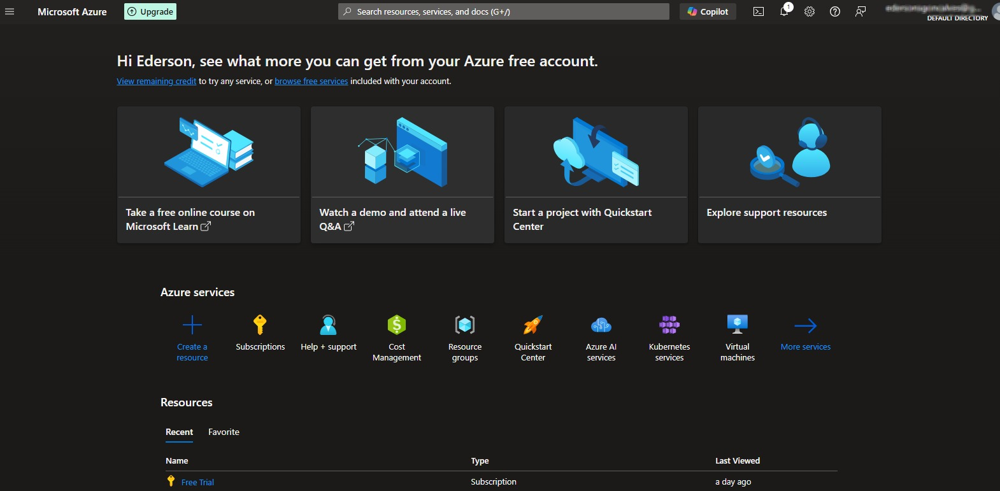
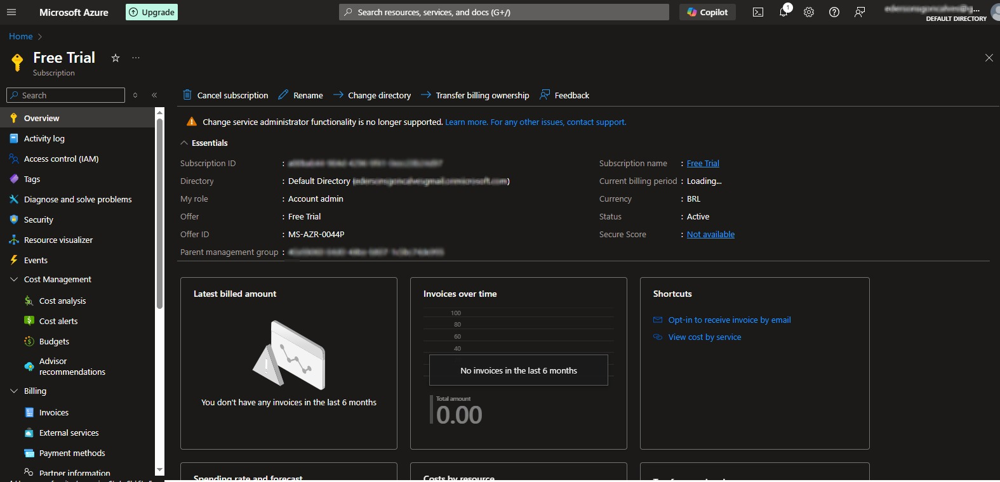
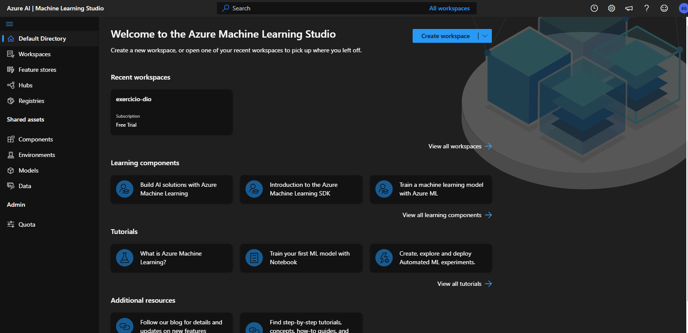
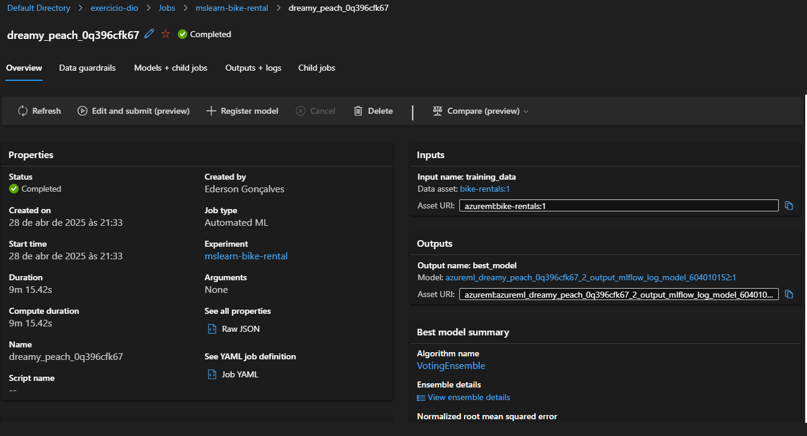
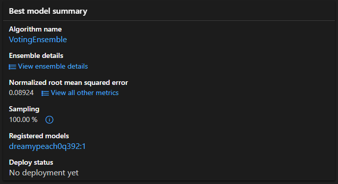
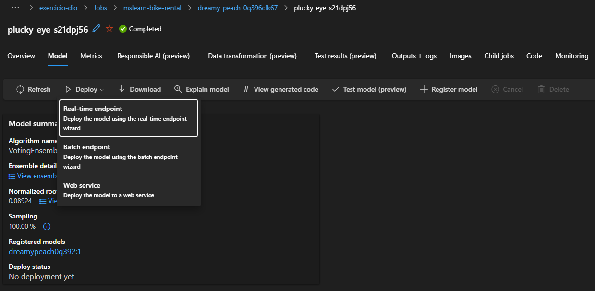
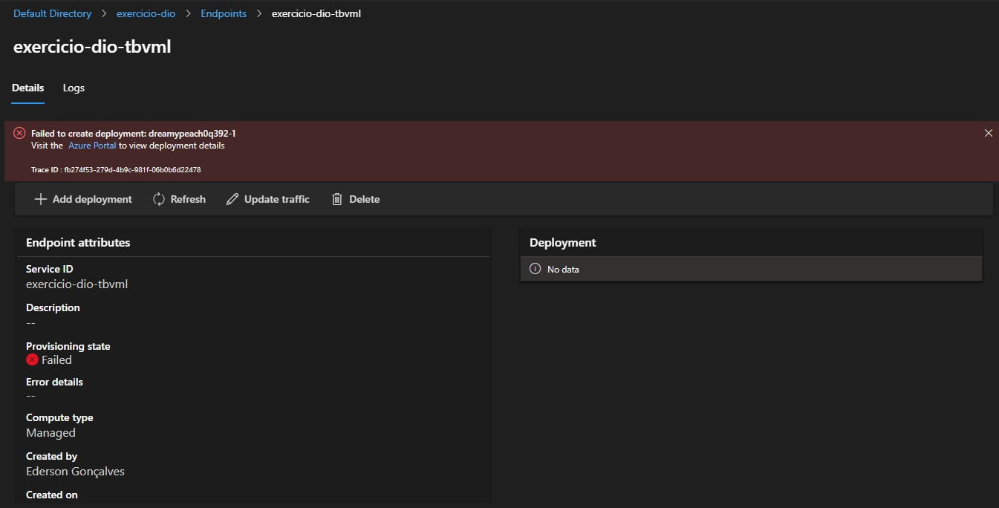
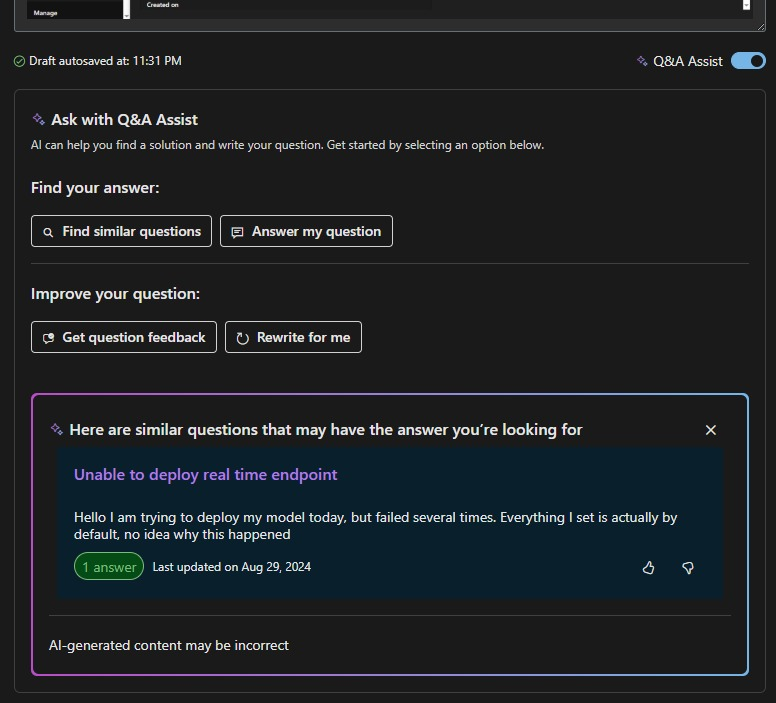
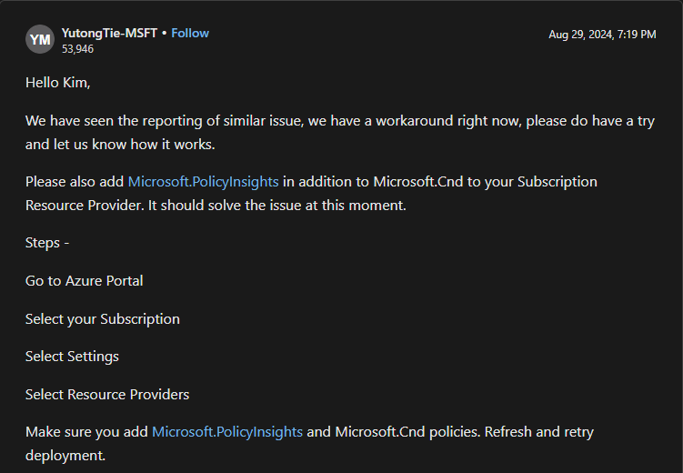
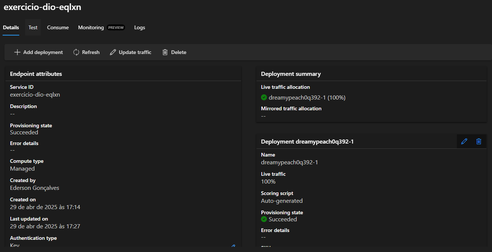

# Implementação Modelagem Machine Learning
Este repositório busca documentar uma implementação da Modelagem em Machine Learning Azure trazendo os passos executados. 
  
## Passos Iniciais
Criação do acesso ao Portal Azure (www.portal.azure.com);

Criação da Subscrição

Acesso ao Azure Machine Learning Studio (www.ml.azure.com)

## Acesso ao Conjunto de Dados
Foi fornecido um conjunto de dados baseados na quantidade de aluguéis de bicicleta em um dado período.
O objetivo era fazer uma predição, baseado no modelo de **Regressão** (dados históricos), da quantidade de aluguéis que potencialmente ocorreriam.

## Configuração dos parâmetros
Após o upload da base de dados, foi iniciada a configuração dos parâmetros e máquinas virtuais para realizar a análise dos dados.

## O Algoritmo Mais Ajustado
Após a analise, o algoritmo com o melhor desempenho foi o *VotingEnsemble*. 

Dessa forma, entrei no algoritmo e rodei a implementação do *Ponto de Extremidade* (Endpoint) em *Tempo Real* (Real-time), que se refere a disponibilização do modelo de aprendizado de máquina para uso imediato, permitindo receber solicitações e realizando previsões em tempo real. 

## O Fatídico Erro
Após a configuração dos parâmetros, reserva da máquina virtual e início do *deployment*, o sistema passou a exibir um erro mas sem informações do motivo de ter gerado esse erro. 

Realizei busca incialmente na documentação da Azure, mas como não tinha a relação do motivo da falha, não tive retorno produtivo.
Removi todos os dados e refiz os passos da aplicação por cerca de 5 vezes..
Nesse processo, tentei alterar diversos parâmetros mas sempre caia nesse mesmo erro.

## Microsoft Learn: O Início da Solução
Entrei no Microsoft Learn na intenção de Abrir um Ticket para a comunidade, a fim de saber se o erro havia acontecido com mais alguém.

Ao finalizar o preenchimento do forumulário, notei que havia um *Q&A Assist*. Daí cliquei em **Find Similar Questions** já totalmente desacreditado de achar algo.

Foi então que ele me retornou com o artigo [**Unable to deploy real time endpoint**](https://learn.microsoft.com/en-us/answers/questions/2028895/unable-to-deploy-real-time-endpoint) em que o usuário [**YutongTie-MSFT**](https://learn.microsoft.com/en-us/users/na/?userid=ad870133-9538-4d77-adc8-2b5ffc5c1b45) postou sobre alguns recursos que deveriam estar ativados na *Subscription*.

Ao ativar esses recursos e refazer o teste, obtive sucesso no *Deployment* e o modelo rodou sem mais problemas.

## Resultado da Previsão
Abaixo compartilho o JSON do modelo e o retorno gerado.

Racional:
`{ "input_data": { "columns": [ "day", "mnth", "year", "season", "holiday", "weekday", "workingday", "weathersit", "temp", "atemp", "hum", "windspeed" ], "index": [0], "data": [[1,1,2022,2,0,1,1,2,0.3,0.3,0.3,0.3]] } }`

Resultado:
`[
  352.1927852527399
]`